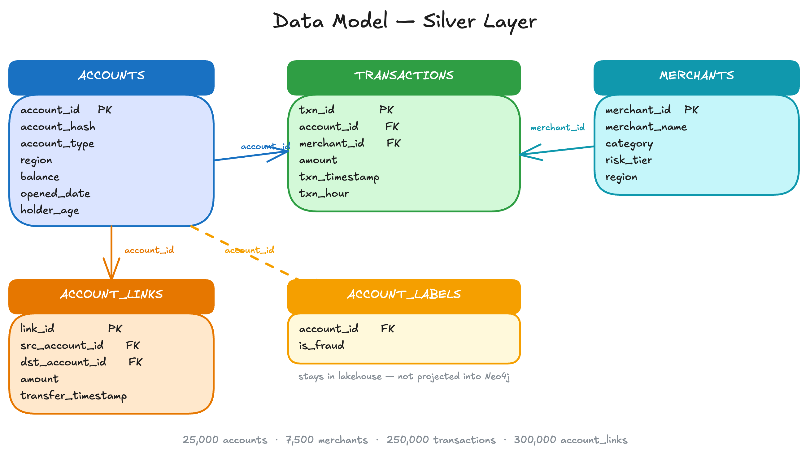

<style>
section {
  --marp-auto-scaling-code: false;
}

li {
  opacity: 1 !important;
  animation: none !important;
  visibility: visible !important;
}

.marp-fragment {
  opacity: 1 !important;
  visibility: visible !important;
}

ul > li,
ol > li {
  opacity: 1 !important;
}
</style>

# Graph-Enriched Lakehouse

Combining Databricks Genie with Neo4j Graph Data Science

<!--
One-line argument: financial crime is a network problem, the row
is the wrong unit of analysis, and we close that gap by running
Neo4j GDS as a silver-to-gold enrichment stage in front of
Databricks Genie. Framing throughout: expansion, not limitation
recovery.
-->

---

## What This Talk Covers

1. **Anchor.** One fraud question, two answers — before and after enrichment
2. **Architecture.** Why the second answer needed a different data layer
3. **Pipeline.** How the columns behind the second answer are built

Plus: where this pattern applies beyond fraud.

<!--
Three parts over 15 minutes. The anchor opens with a before/after
reveal on one question; architecture explains what Neo4j adds; the
pipeline shows how the features that produced the after answer are
built. Pitch the enriched lakehouse as unlocking a new set of
questions for Genie — not as patching a Genie shortcoming.
-->

---

## Demo Data Set: Synthetic Banking Network

- **Two financial networks:** a spending graph and a peer-to-peer transfer graph
- **Spending graph:** accounts transact with merchants
- **Transfer graph:** accounts send money directly to other accounts
- **Fraud rings** leave structural footprints in both
- The goal: surface those patterns, not score individual transactions

<!--
The dataset contains two overlapping networks. The first is a
bipartite account-merchant graph: accounts spend at merchants.
The second is a peer-to-peer transfer network: accounts send money
directly to other accounts. Fraud rings leave footprints in both —
tight clusters of accounts trading with each other and routing
through the same merchants. The goal is not to label fraud; it is
to make the structural patterns visible so analysts can investigate.
-->

---



---

## Financial Crime Hides Between the Rows / Financial Fraud: Pattern Detection

- **Coordinated fraud** spreads activity across dozens of accounts on purpose
- **Each transaction looks clean in isolation**
- **The fraud is hidden in the patterns across the accounts**
- **Row-level aggregation cannot produce a property that lives in the connections**

<!--
Money laundering rings, mule networks, and coordinated schemes
deliberately split activity across accounts to evade per-account
detection. The pattern is network-level; no GROUP BY recovers it.
This sets up the anchor reveal on the next slide.
-->

---

## Merchant Favorites: One Question, Two Answers

*"Which merchants are most commonly visited by accounts in ring-candidate communities?"*

- **Before (raw lakehouse):** Top merchants by overall visit count — popular chains, sounds plausible
- **After (enriched lakehouse):** Specific list of merchants where ring-community members cluster disproportionately

**Same question. Different answer. Which one would you investigate?**

<!--
This is the anchor. Run both questions live in Genie — before
against the base catalog, after against the enriched catalog —
so the gap is visible in real time.

Hold on the two answers until someone asks "how did you get
that?" — that is the invitation into Architecture. If nobody
asks, offer it: "does anyone want to know how we got to that
specific list of merchants?"
-->

---

## What We Need: Better Columns for Better Genie Answers

- **The gap is in the columns, not in Genie.** Structural questions have no column to query against — yet
- **The result looks authoritative but answers the wrong question:** proxies surface — volume, frequency, balance — not the structural signal the analyst actually wants
- **Add graph-derived columns** and the right accounts are findable by any tool, including Genie
- **Change the columns. Change what Genie finds.**

<!--
One-slide answer to "how did you get that?" before the deeper
data-layer explanation. Reframes the gap as column inventory,
not a Genie shortcoming — expansion, not limitation recovery.
The rest of the Architecture section explains how those columns
get produced.
-->

---

## Finding Patterns Requires a Different Data Layer

- **Patterns live in network topology,** not in the rows of a table
- **"Which accounts are central in the flow of money?"** Centrality is a network position — no SQL aggregation produces it
- **"Which accounts cluster tightly together?"** Community is a density across many edges — no GROUP BY captures it
- **"Which accounts route through the same merchants?"** Overlap is a neighborhood property — no join recovers it

<!--
Three connection questions, three reasons SQL cannot reach them.
The answer to each exists in the network, not in the rows. The
next slide explains what data layer can reach them.
-->

---

## SQL Traversal Starts from an Account. A Graph Database Starts from a Pattern.

- **SQL traversal needs a starting point** — a specific account ID or customer number
- **A graph database needs only the pattern** and finds every instance in the network
- **Structural questions need a data layer built for connections**

<!--
Traditional databases are point-lookup machines; graph databases
are pattern-matching machines. You do not need to know which
accounts to investigate — describe the shape of a ring and the
graph returns every place that shape exists.
-->

---

## Graph Database and Lakehouse Work Together

- **The graph** is the right data layer for connection questions
- **The lakehouse** is the right layer for aggregates, joins, and the business questions Genie already handles well
- **Compute the connection patterns in the graph, land them as columns in the lakehouse, let Genie answer against them**

<!--
The pivot that reframes this work as expansion. Genie is working
as designed throughout; we are not patching Genie. We are giving
Genie new dimensions — community, centrality, similarity — that
it can group by, filter on, and compare across using the SQL it
already generates well.
-->

---

## The Enrichment Pipeline

Four steps convert a network of account relationships into plain columns that Genie queries like any other dimension.

- **Load — Silver into Neo4j:** Account and transaction records from the existing lakehouse map into Neo4j Aura as a network of connected entities
- **Run GDS — patterns become columns:** Graph algorithms surface structural patterns: which accounts are central to money flow, which cluster together, which share the same connections
- **Enrich — results land in Gold:** Databricks pulls GDS outputs from Neo4j via the Spark Connector, joins with Silver, and writes `risk_score`, `community_id`, and `similarity_score` as plain Delta columns
- **Query — auditable by construction:** Nothing in the graph reaches a Genie query until the pipeline has materialized it into Gold; the audit trail is the Delta table

<!--
Four steps. Structural analysis runs once per pipeline cycle;
every downstream consumer reads the results as columns. The
graph analysis is invisible to the query layer.
-->

---

## Architecture at a Glance

```
Unity Catalog Silver          Neo4j Aura + GDS               Unity Catalog Gold
+-------------------+         +-------------------+          +---------------------------+
| accounts          |         | PageRank          |          | gold_accounts             |
| account_links     |--load-->| Louvain           |--pull--> |   risk_score              |
| merchants         |         | Node Similarity   |  Spark   |   community_id            |
| transactions      |         | property graph    |  + join  |   similarity_score        |
| account_labels    |         +-------------------+          +---------------------------+
+-------------------+                                        | gold_account_             |
                                                             |   similarity_pairs        |
                                                             +---------------------------+
                                                                        |
                                                                        v
                                                             +--------------------+
                                                             | Databricks Genie   |
                                                             | text-to-SQL        |
                                                             +--------------------+
```

- **The graph and the warehouse are connected entirely through enriched Delta tables.** No live query path between them
- **Databricks pulls account features from Neo4j via the Spark Connector** and joins them with Silver tables before writing Gold — `account_labels` feeds the join but is not loaded into Neo4j

<!--
The pull direction matters. Neo4j does not write to Unity Catalog
directly; Databricks pulls from Neo4j via the Spark Connector in
nb04, joins with Silver tables (accounts, account_labels), and
materializes the Gold tables. Nothing in the graph reaches
production queries except what the pipeline has already
materialized to Gold.

Two Gold tables support the Genie AFTER demo: gold_accounts
(account metadata + three GDS features) and
gold_account_similarity_pairs (similarity edge pairs).
-->

---

## Sample GDS Algorithms

- **PageRank → `risk_score`:** centrality in the account transfer network; which accounts the most-connected accounts route flow through
- **Louvain → `community_id` / `fraud_risk_tier`:** community membership by transaction density; accounts that trade more tightly with each other than with the rest of the network
- **Node Similarity → `similarity_score`:** overlap of shared merchant connections; two accounts that never transacted directly can score high if they route through the same merchants

<!--
GDS output is deterministic given a fixed graph projection: same
projection, same scores, every time. That reproducibility matters
because these scores become columns in a catalog that a
non-deterministic translator queries.

PageRank: eigenvector centrality over the account-to-account transfer graph.
Fraud population averages 3.65× the centrality of non-fraud accounts on the
demo dataset.

Louvain: modularity-optimal partition. Each of the ten synthetic rings lands
in its own community with 100% ring coverage; average community purity is 70%
(~100 ring members + ~44 non-ring accounts per ring-candidate community).
fraud_risk_tier is a derived column, not a direct GDS output.

Node Similarity: Jaccard overlap of shared-merchant sets over the bipartite
account-merchant graph. Fraud ring members score 1.98× higher than non-fraud
on average. Degree cutoff: accounts with fewer than five unique merchant visits
are excluded; 3.2% of ring members fall below.
-->

---

## The Graph Finds Candidates. The Analyst Finds Fraud.

- **GDS produces structural signals that indicate ring-like behavior:** community membership, centrality, similarity
- **A high-risk community is a candidate, not a verdict**
- **The analyst runs ordinary Genie queries against the enriched Gold tables** to decide which accounts and merchants warrant investigator time

<!--
The pipeline makes no judgment call. It surfaces shapes that
resemble rings and lets analysts do the fraud work with the
tools they already use. The "after" questions in this demo —
merchant concentration, regional review workload, book share by
community — are that workflow.
-->

---

## The Analyst's Toolkit, Expanded

- **`community_id` and `fraud_risk_tier`** sit alongside region, product, and balance as ordinary dimensions
- **Questions that had no handle before:** candidate-population sizing, regional review workload, merchant concentration by community
- **`GROUP BY fraud_risk_tier`** — not "find the ring"

**Same Genie, same SQL. New dimensions. Strictly more answers.**

<!--
Expansion, not limitation recovery. The analyst works in Genie
the same way they always have; the difference is that graph-
derived columns are now available as ordinary dimensions.
-->

---

## Where This Pattern Applies

- **Fraud-ring surfacing:** tight-community trading, shared merchant preferences that do not fit the background distribution
- **Entity resolution:** collapsing customer, device, and household records that refer to the same real-world entity based on shared attributes and topology
- **Supplier-network risk:** tiers of supplier exposure, single points of failure, concentrations of risk in multi-tier supply graphs
- **Recommendation structure:** communities of users, products, or content with shared consumption patterns as features for downstream recommenders
- **Compliance network review:** counterparty clusters and beneficial-ownership paths that require human review under regulatory frameworks

<!--
Generalize the pattern. Anywhere the answer lives in
relationships rather than individual rows, GDS-as-silver-to-gold
applies. The algorithm changes; the architecture does not.
-->

---

## Key Takeaways

- **One question, two answers** — the gap is the whole argument
- **Graph for connection questions, lakehouse for everything Genie already does well**
- **GDS columns land in Gold as ordinary dimensions** — the analyst's toolkit gets bigger, not different

<!--
Three points aligned to the three-part structure: the anchor, the
architecture, the payoff. Close on expansion framing.
-->

---

## Fill-in / Q&A

The following slides apply when running the demo live or fielding detailed questions about how Genie behaves under the hood.

---

## Genie in Action on the Existing Catalog

Two questions from the base catalog, Genie answering what it's built for:

- **Q1:** "What are the top 10 accounts by total amount spent across merchants?" — clean ranked list; standard aggregation over `transactions`
- **Q2:** "Show accounts with above-average spend and more than 20% of transactions at night" — join and conditional aggregate; correct top-15 with night ratio and balance
- **Genie doing its designed job** on the catalog the customer already runs
- **The SQL shapes are standard:** all dimensions live in the base tables

<!--
Use this slide if the audience wants to see Genie on the raw
catalog first. It establishes that Genie is a capable BI
translator before any enrichment happens.
-->

---

## Deterministic Foundation, Non-Deterministic Translation

- **Genie generates different SQL each run.** Same question, different shape: `RANK()=1` one time, `LIMIT 100` the next. That is how text-to-SQL works
- **GDS columns are fixed.** Same projection, same scores, every time. The signal does not move
- **The combination is reliable:** SQL variance only changes how much signal Genie surfaces, never whether it exists

<!--
The architectural claim that answers "can we trust Genie?" You
do not need a deterministic LLM. You need a deterministic column
inventory underneath a non-deterministic translation layer.
-->

---

## Defensibility

- **GDS produces features with published mathematical definitions** — PageRank, Louvain, Jaccard
- **Humans and downstream models adjudicate, not the pipeline**
- **The pipeline surfaces candidates; it does not label fraud**

<!--
Defensible framing for regulated environments. GDS outputs are
reproducible under a fixed projection; whatever reads the columns
adjudicates: investigator triage, supervised classifier, analyst
in Genie.
-->
